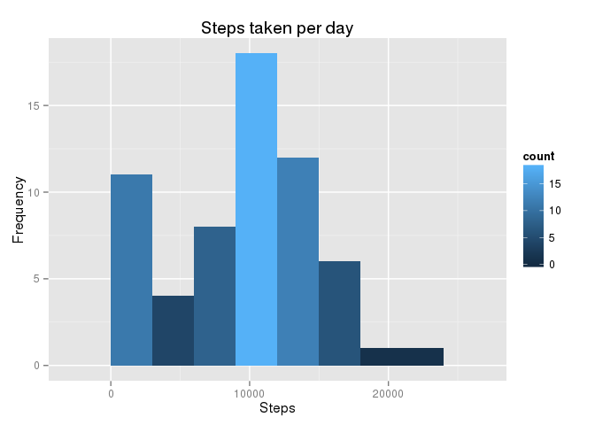

# Reproducible Research: Peer Assessment 1
 

This assignment makes use of data from a personal activity monitoring device. This device collects data at 5 minute intervals through out the day. The data consists of two months of data from an anonymous individual collected during the months of October and November, 2012 and include the number of steps taken in 5 minute intervals each day.  

### Data

The data for this assignment can be downloaded from the course web site:

* Dataset: [Activity monitoring data][1] [52K]

The variables included in this dataset are:

* steps: Number of steps taking in a 5-minute interval (missing values are coded as NA)  
* date: The date on which the measurement was taken in YYYY-MM-DD format  
* interval: Identifier for the 5-minute interval in which measurement was taken  

The dataset is stored in a comma-separated-value (CSV) file and there are a total of 17,568 observations in this dataset.  

Load the packages and options required for the R scripts.  


```r
library(knitr)
library(ggplot2)
library(data.table)
library(plyr)
require(scales)
```

```
## Loading required package: scales
```

```r
opts_chunk$set(fig.path="figure/")
```

## Loading and preprocessing the data  

### Load the data  

First the file is downloaded and unzipped in a folder called "data" in the current working directory of R; which is a prerequsite, prior to loading and processing the data. 

The CSV file is imported into a data frame (named - "activityData"), and using the "colClasses" argument to specify the data type for each column.  


```r
classes <- c("integer", "Date", "integer" )
activityData <- read.csv(file = "./data/activity.csv", stringsAsFactors = FALSE, colClasses = classes)

summary(activityData)
```

```
##      steps             date               interval     
##  Min.   :  0.00   Min.   :2012-10-01   Min.   :   0.0  
##  1st Qu.:  0.00   1st Qu.:2012-10-16   1st Qu.: 588.8  
##  Median :  0.00   Median :2012-10-31   Median :1177.5  
##  Mean   : 37.38   Mean   :2012-10-31   Mean   :1177.5  
##  3rd Qu.: 12.00   3rd Qu.:2012-11-15   3rd Qu.:1766.2  
##  Max.   :806.00   Max.   :2012-11-30   Max.   :2355.0  
##  NA's   :2304
```

```r
str(activityData)
```

```
## 'data.frame':	17568 obs. of  3 variables:
##  $ steps   : int  NA NA NA NA NA NA NA NA NA NA ...
##  $ date    : Date, format: "2012-10-01" "2012-10-01" ...
##  $ interval: int  0 5 10 15 20 25 30 35 40 45 ...
```


### Process/transform the data  

Process/transform the data into a suitable format for analysis. The existing "interval" column in the data frame identifies the 5-minute interval in which measurement was taken, and is an integer value.
Add a new column which converts the "interval" column into a time format (human readable).  


```r
intervalCol <- activityData$interval
activityData$timeInterval <- sprintf("%02d:%02d", intervalCol%/%100, intervalCol%%100)
```


## What is mean total number of steps taken per day?

### Calculate the total number of steps taken per day  

Use the aggregate function to calculate the total number of steps for each day (by date), saving the result to a data set called "stepsPerDay"; then using the setnames function, from the data.tables package, to set the column names. 

**Note: Missing values in the data set are ignored.**  


```r
stepsPerDay <- aggregate(activityData$steps, by = list(activityData$date), FUN = sum, na.rm = TRUE)

setnames(stepsPerDay, c("date", "steps"))
```

### Histogram of the total number of steps taken per day  

Take the data set "stepsPerDay" to be plotted, pass the "steps" column from the "stepsPerDay" data set as values on the x-axis and compute a histogram of this:  


```r
ggplot(stepsPerDay, aes(x = (steps))) + 
        labs( x = "Steps", y = "Frequency", title = "Steps taken per day") + 
        geom_histogram(binwidth = 3000 ,aes(fill = ..count..))
```

 

### Calculate the mean and median of the total number of steps taken per day  


```r
summary(stepsPerDay)
```

```
##       date                steps      
##  Min.   :2012-10-01   Min.   :    0  
##  1st Qu.:2012-10-16   1st Qu.: 6778  
##  Median :2012-10-31   Median :10395  
##  Mean   :2012-10-31   Mean   : 9354  
##  3rd Qu.:2012-11-15   3rd Qu.:12811  
##  Max.   :2012-11-30   Max.   :21194
```

```r
meanValue <- mean(stepsPerDay$steps)

medianValue <- median(stepsPerDay$steps)
```

The mean of the total number of steps taken per day is **9354.2295082**.  
The median of the total number of steps taken per day is **10395**.

## What is the average daily activity pattern?  

First step - Create a data set containing the mean of the steps for each five minute interval.  

**Note: Missing values in the data set are ignored.**  


```r
avgStepsByInterval <- ddply(activityData, .(timeInterval), summarise, avgSteps=mean(steps, na.rm = TRUE))

summary(avgStepsByInterval)
```

```
##  timeInterval          avgSteps      
##  Length:288         Min.   :  0.000  
##  Class :character   1st Qu.:  2.486  
##  Mode  :character   Median : 34.113  
##                     Mean   : 37.383  
##                     3rd Qu.: 52.835  
##                     Max.   :206.170
```


### Time series plot of the 5-minute interval (x-axis) and the average number of steps taken, averaged across days (y-axis).  


```r
### Set the labels for the title, x-axis and y-axis
mainLab <- "The Average Steps By Time Interval"
xLab <- "Time Intervals"
yLab <- "Average Number of Steps Taken"

ggplot( data = avgStepsByInterval, aes(x = strptime(timeInterval, format="%H:%M"), y = avgSteps)) + 
        geom_line() + 
        labs(title = mainLab, x = xLab, y = yLab) + 
        scale_x_datetime(labels = date_format("%H:%M"),breaks = date_breaks("2 hour"))
```

 

### Identifying the 5-minute interval, on average across all the days in the data set, that contains the maximum number of steps.  


```r
maxAVGStepsInt <- avgStepsByInterval[which.max(avgStepsByInterval$avgSteps), ]
maxAVGStepsInt
```

```
##     timeInterval avgSteps
## 104        08:35 206.1698
```

## Imputing missing values

Note that there are a number of days/intervals where there are missing values (coded as **NA**). The presence of missing days may introduce bias into some calculations or summaries of the data.


### Calculating and reporting the total number of missing values in the 'activityData' data set - i.e. the total number of rows with NAs.  


```r
summary(activityData)
```

```
##      steps             date               interval      timeInterval      
##  Min.   :  0.00   Min.   :2012-10-01   Min.   :   0.0   Length:17568      
##  1st Qu.:  0.00   1st Qu.:2012-10-16   1st Qu.: 588.8   Class :character  
##  Median :  0.00   Median :2012-10-31   Median :1177.5   Mode  :character  
##  Mean   : 37.38   Mean   :2012-10-31   Mean   :1177.5                     
##  3rd Qu.: 12.00   3rd Qu.:2012-11-15   3rd Qu.:1766.2                     
##  Max.   :806.00   Max.   :2012-11-30   Max.   :2355.0                     
##  NA's   :2304
```

```r
missingValues <- sum(is.na(activityData$steps))
missingValues#
```

```
## [1] 2304
```

The total number of missing values in the activityData data set is **2304**.    

### Strategy for filling in all of the missing values in the dataset.  

The mean of the 5-minute interval is used to fill in the missing values (NAs) from the 'activityData' data set. This is incorporated into a new data set called 'fillNAs'.  


## Are there differences in activity patterns between weekdays and weekends?

[1]: https://d396qusza40orc.cloudfront.net/repdata/data/activity.zip "Activity Monitoring Data"
